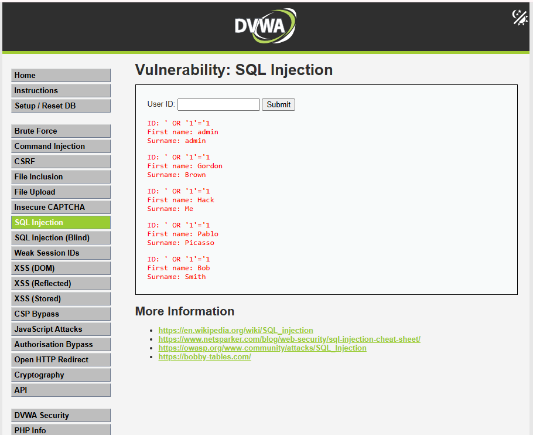

# Task 3 — SQL Injection on DVWA

## Overview

This task demonstrates a SQL Injection vulnerability using Damn Vulnerable Web Application (DVWA).

The testing was performed in a controlled local environment using XAMPP. The DVWA security level was set to **Low** for the demonstration.

DVWA is intentionally designed as a vulnerable web application for learning and practicing web application security.

---

## Objective

The objectives of this task were to:

* Set up DVWA locally using XAMPP.
* Configure DVWA security level to Low.
* Test the SQL Injection module.
* Use two different SQL Injection payloads.
* Observe the data returned by the vulnerable application.
* Document the vulnerability and its impact.
* Explain methods for preventing SQL Injection.

---

## Environment

| Component        | Details       |
| ---------------- | ------------- |
| Operating System | Windows       |
| Web Server       | XAMPP         |
| Application      | DVWA          |
| Database         | MySQL         |
| Security Level   | Low           |
| Target           | Localhost     |
| Testing Module   | SQL Injection |

The DVWA SQL Injection module uses a GET request at Low security and accepts the User ID through a text input.

---

## SQL Injection

SQL Injection is a web application vulnerability that occurs when user input is improperly included in an SQL query.

An attacker can provide specially crafted input that changes the logic of the SQL query and may cause unauthorized database records to be returned.

---

## Payload 1

### Payload

```text
1' OR '1'='1
```

### Result

The payload successfully returned multiple records from the database.

The following records were displayed:

* admin — admin
* Gordon — Brown
* Hack — Me
* Pablo — Picasso
* Bob — Smith

### Screenshot

`Screenshots/05-sqli-payload-1.PNG`

### Analysis

The condition `'1'='1'` is always true. Because the input is not safely handled at the Low security level, the injected condition changes the intended SQL query and causes multiple records to be returned.

---

## Payload 2

### Payload

```text
1' OR 1=1 #
```

### Result

The payload also successfully returned multiple records:

* admin — admin
* Gordon — Brown
* Hack — Me
* Pablo — Picasso
* Bob — Smith

### Screenshot

`Screenshots/06-sqli-payload-2.PNG`

### Analysis

The condition `1=1` is always true. The `#` character comments out the remaining part of the SQL statement in MySQL/MariaDB syntax.

---

## Data Exposed

The SQL Injection demonstration exposed multiple user records that would not normally be returned for a single user ID.

The observed information included:

* User IDs
* First names
* Surnames

A total of five records were returned by each tested payload.

---

## Prevention

SQL Injection can be prevented by using **parameterized queries / prepared statements**.

Instead of directly placing user input into an SQL query, applications should use prepared statements such as:

```text
SELECT * FROM users WHERE user_id = ?
```

Other recommended security measures include:

* Validate user input.
* Use prepared statements.
* Avoid SQL query concatenation with user input.
* Apply least-privilege database permissions.
* Perform regular security testing.

The DVWA project also provides a secure/impossible implementation for comparison with the vulnerable versions.

---

## Ethical Considerations

This testing was performed only against a locally hosted DVWA application created specifically for security practice.

No real website, server, database, or third-party service was targeted.

SQL Injection testing should only be performed on systems where explicit permission has been provided.

---

## Screenshots

### Payload 1



### Payload 2


---

## Conclusion

The SQL Injection vulnerability was successfully demonstrated on DVWA with the security level set to Low.

Two different SQL Injection payloads were tested and both successfully returned multiple database records.

This exercise demonstrates the risks of directly using user input in SQL queries and highlights the importance of parameterized queries and prepared statements for preventing SQL Injection.
